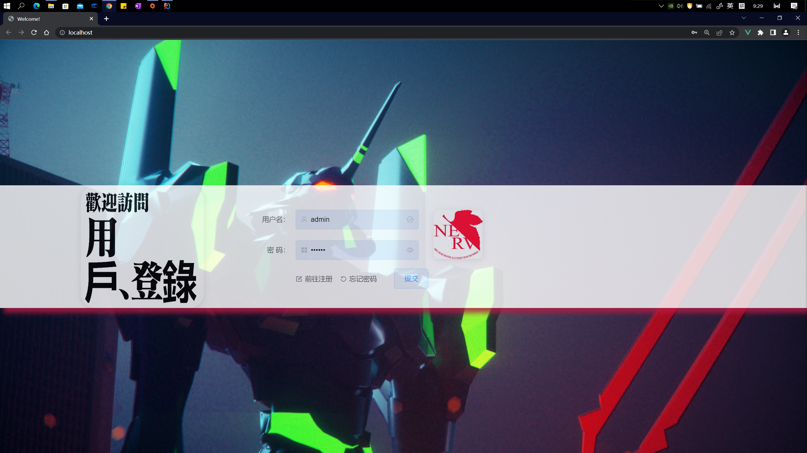
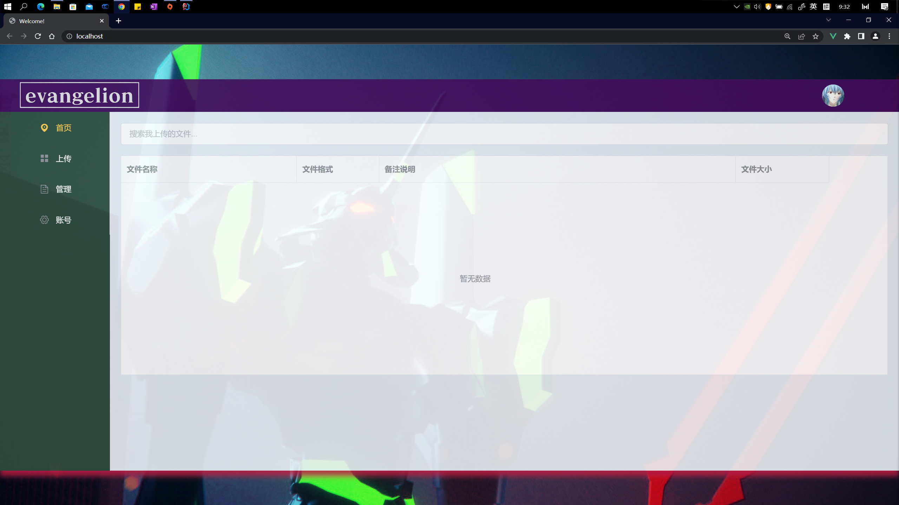
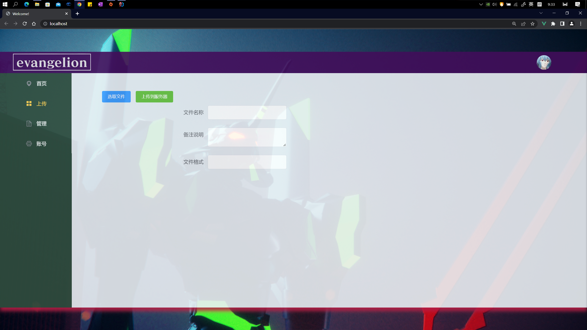
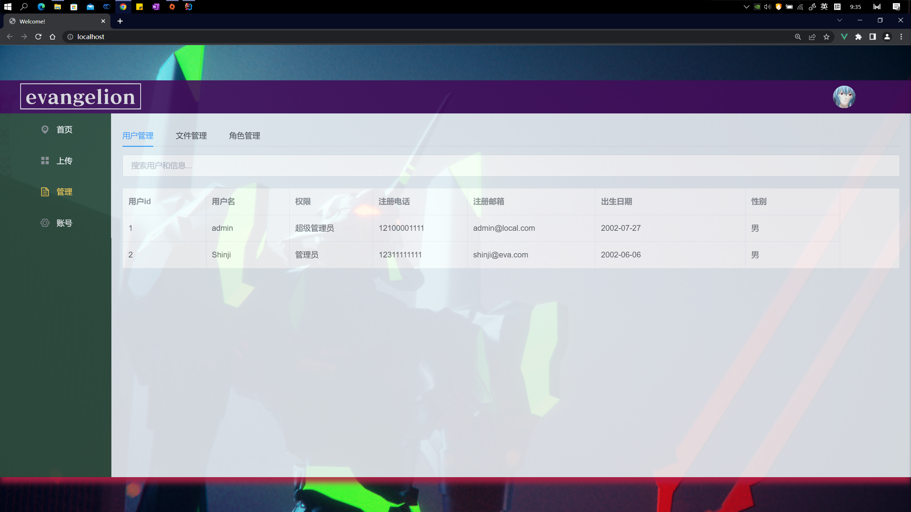

# SSM
> HolanSwide
>
> 这是一个简单的基础项目，采用 Spring + SpringMVC +Mybatis 架构搭建，服务器采用 tomcat，数据库使用的是 MySQL
> 
> 前端采用Vue+Element-ui构建
>
> 版本：
> - Spring 5.2.5.RELEASE
> - SpringMVC 5.1.19
> - Mybatis 2.0.7
> - tomcat 8.5.73
> - MySQL 5.5

# description

这是一个完成度较高的Web项目，实现了一个在线云盘最基本的几个功能：文件上传、下载、查找与删除；用户注册、登录、信息修改与权限管理。

# install

1. 在MySQL中执行 [ssm.sql](./ssm.sql) 文件
2. 修改 [spring-config.xml](./src/main/resources/spring-config.xml) 中数据源的配置信息
3. 使用Maven对项目进行编译打包，得到 .war 文件
4. 配置Tomcat服务器：端口设置为80，项目路径设置为/
5. 部署到服务器，重启服务器安装完成，通过 http://localhost/ 即可访问项目

> **注意**：若需上线云服务器，请修改 Controller 和 js 包下所有文件的URL信息

# usage

1. 登录页：用户名`admin` 密码`123456`

2. 首页

3. 上传

**注意**：文件名称限制在32个字符内，文件大小限制在100M以内
4. 管理（超级管理员界面）

5. 个人页

# logging

## day1
> 2022年6月23日23点58分

- 搭建了基本SSM框架
- 搭建了数据库ssm，建立好了第一个表 user
- 创建了用户类 User
- 测试好了框架之间的协    同

## day2
> 2022年6月24日16点46分

- 完成登录和注册功能
- 问题：controller中添加事务注解时出现错误

## day03
> 2022年6月25日16点11分
                                    
- 采用Vue框架重构

## day04
> 2022年8月6日15点24分

- 如何使Controller返回数据而非页面
> 在对应方法体上添加注解`@ResponseBody`,
> 同时要在`@RequestMapping`注解中加入参数`produces={"application/json;charset=UTF-8"}`以防止乱码

- 拦截器添加满足条件的不拦截的站点

> 见 [spingmvc-config.xml](./src/main/resources/springmvc-config.xml) 和
> [LoginInterceptor.java](./src/main/java/com/holanswide/interceptor/LoginInterceptor.java) 

- 完成了注册登录功能的重构
- 写好了拦截器

## day05
> 2022年8月10日15点32分

- 使用Vue+Element-ui进行前端重构
- 增加数据表user_info记录用户信息

## day06
> 2022年8月11日23点22分

- 完成了登录-注册-修改密码功能

## day07
> 2022年8月24日09点08分

- 补充应用使用说明